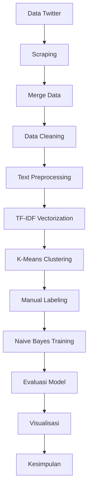

# Design Document: Analisis Sentimen Twitter Sertifikasi Halal

## Overview

Sistem ini dirancang untuk menganalisis sentimen masyarakat Indonesia terhadap sertifikasi halal berdasarkan data Twitter/X. Penelitian menggunakan pendekatan hybrid yang menggabungkan:

1. **K-Means Clustering** (unsupervised) - untuk eksplorasi pola dan pengelompokan data awal
2. **Naive Bayes** (supervised) - untuk klasifikasi sentimen dengan akurasi terukur

### Alur Penelitian



## Architecture

### Arsitektur Pipeline

```
┌─────────────────────────────────────────────────────────────────────┐
│                        DATA COLLECTION LAYER                         │
├─────────────────────────────────────────────────────────────────────┤
│  Scraping.ipynb → mergeData.ipynb → dataSertifikasiHalal.csv        │
└─────────────────────────────────────────────────────────────────────┘
                                    │
                                    ▼
┌─────────────────────────────────────────────────────────────────────┐
│                        DATA PROCESSING LAYER                         │
├─────────────────────────────────────────────────────────────────────┤
│  CleaningData.ipynb → Preprocessing.ipynb → cleaned_data.csv        │
└─────────────────────────────────────────────────────────────────────┘
                                    │
                                    ▼
┌─────────────────────────────────────────────────────────────────────┐
│                      FEATURE EXTRACTION LAYER                        │
├─────────────────────────────────────────────────────────────────────┤
│  TF-IDF Vectorization → Sparse Matrix (n_docs × n_features)         │
└─────────────────────────────────────────────────────────────────────┘
                                    │
                    ┌───────────────┴───────────────┐
                    ▼                               ▼
┌───────────────────────────────┐   ┌───────────────────────────────┐
│     UNSUPERVISED ANALYSIS     │   │     SUPERVISED ANALYSIS       │
├───────────────────────────────┤   ├───────────────────────────────┤
│  K-Means Clustering           │   │  Naive Bayes Classification   │
│  - Elbow Method               │──▶│  - Train/Test Split           │
│  - Silhouette Score           │   │  - Model Training             │
│  - Cluster Interpretation     │   │  - Evaluation Metrics         │
└───────────────────────────────┘   └───────────────────────────────┘
                    │                               │
                    └───────────────┬───────────────┘
                                    ▼
┌─────────────────────────────────────────────────────────────────────┐
│                        VISUALIZATION LAYER                           │
├─────────────────────────────────────────────────────────────────────┤
│  WordCloud │ Distribution Charts │ Elbow Plot │ Confusion Matrix    │
└─────────────────────────────────────────────────────────────────────┘
```

### Struktur File Proyek

```
project/
├── data/
│   ├── makananSertifikasiHalal.csv
│   ├── MUI.csv
│   ├── pengesahanProdukMUI.csv
│   ├── produkHalal.csv
│   ├── produkHaram.csv
│   ├── sertifikasiHalal.csv
│   ├── sertifikasiHaram.csv
│   ├── dataSertifikasiHalal.csv      # Hasil merge
│   ├── hasil_cleaning.csv             # Hasil cleaning
│   └── hasil_preprocessing.csv        # Hasil preprocessing
├── output/
│   ├── visualizations/                # Folder untuk grafik
│   └── models/                        # Folder untuk model
├── Scraping.ipynb                     # ✅ Sudah ada
├── mergeData.ipynb                    # ✅ Sudah ada
├── CleaningData.ipynb                 # ⏳ Perlu enhancement
├── Preprocessing.ipynb                # 🆕 Akan dibuat
├── TF-IDF_KMeans.ipynb               # 🆕 Akan dibuat
├── NaiveBayes_Classification.ipynb   # 🆕 Akan dibuat
└── Visualisasi.ipynb                  # 🆕 Akan dibuat
```

## Components and Interfaces

### 1. Data Cleaning Component

**Input:** `dataSertifikasiHalal.csv` (raw data)
**Output:** `hasil_cleaning.csv` (cleaned data)

```python
# Interface fungsi cleaning
def clean_text(text: str) -> str:
    """
    Membersihkan teks dari noise.
    
    Args:
        text: Teks tweet mentah
        
    Returns:
        Teks yang sudah dibersihkan
    """
    pass

def remove_url(text: str) -> str:
    """Menghapus URL dari teks"""
    pass

def remove_mention(text: str) -> str:
    """Menghapus @username dari teks"""
    pass

def remove_hashtag(text: str) -> str:
    """Menghapus #hashtag dari teks"""
    pass

def remove_emoji(text: str) -> str:
    """Menghapus emoji dari teks"""
    pass

def remove_numbers(text: str) -> str:
    """Menghapus angka dari teks"""
    pass

def remove_extra_whitespace(text: str) -> str:
    """Menghapus whitespace berlebih"""
    pass
```

### 2. Text Preprocessing Component

**Input:** `hasil_cleaning.csv`
**Output:** `hasil_preprocessing.csv`

```python
# Interface fungsi preprocessing
def preprocess_text(text: str) -> str:
    """
    Melakukan preprocessing teks NLP.
    
    Args:
        text: Teks yang sudah di-cleaning
        
    Returns:
        Teks yang sudah di-preprocessing
    """
    pass

def case_folding(text: str) -> str:
    """Mengubah teks menjadi lowercase"""
    pass

def tokenize(text: str) -> List[str]:
    """Memecah teks menjadi token"""
    pass

def remove_stopwords(tokens: List[str]) -> List[str]:
    """Menghapus stopword bahasa Indonesia"""
    pass

def stem_words(tokens: List[str]) -> List[str]:
    """Melakukan stemming dengan Sastrawi"""
    pass
```

### 3. TF-IDF Component

**Input:** `hasil_preprocessing.csv`
**Output:** TF-IDF sparse matrix

```python
from sklearn.feature_extraction.text import TfidfVectorizer

# Interface TF-IDF
class TFIDFTransformer:
    def __init__(self, max_features: int = 1000):
        self.vectorizer = TfidfVectorizer(max_features=max_features)
    
    def fit_transform(self, texts: List[str]) -> sparse_matrix:
        """Fit dan transform teks ke TF-IDF matrix"""
        pass
    
    def get_feature_names(self) -> List[str]:
        """Mendapatkan nama fitur/kata"""
        pass
```

### 4. K-Means Clustering Component

**Input:** TF-IDF matrix
**Output:** Cluster labels, cluster centers

```python
from sklearn.cluster import KMeans

# Interface K-Means
class SentimentClustering:
    def __init__(self, n_clusters: int = 3, random_state: int = 42):
        self.model = KMeans(n_clusters=n_clusters, random_state=random_state)
    
    def find_optimal_k(self, X, k_range: range) -> Tuple[List[float], List[float]]:
        """Mencari k optimal dengan Elbow dan Silhouette"""
        pass
    
    def fit_predict(self, X) -> np.ndarray:
        """Melakukan clustering dan return labels"""
        pass
    
    def get_top_terms_per_cluster(self, feature_names: List[str], n_terms: int = 10) -> Dict:
        """Mendapatkan kata dominan per cluster"""
        pass
```

### 5. Naive Bayes Component

**Input:** TF-IDF matrix, labels
**Output:** Trained model, evaluation metrics

```python
from sklearn.naive_bayes import MultinomialNB
from sklearn.model_selection import train_test_split

# Interface Naive Bayes
class SentimentClassifier:
    def __init__(self):
        self.model = MultinomialNB()
    
    def train(self, X_train, y_train) -> None:
        """Melatih model"""
        pass
    
    def predict(self, X_test) -> np.ndarray:
        """Memprediksi sentimen"""
        pass
    
    def evaluate(self, y_true, y_pred) -> Dict:
        """Menghitung metrik evaluasi"""
        pass
```

## Data Models

### Input Data Schema

```python
# Schema data mentah dari scraping
RawTweetSchema = {
    'conversation_id_str': str,
    'created_at': str,           # Format: "Fri Dec 19 16:57:58 +0000 2025"
    'favorite_count': int,
    'full_text': str,            # Teks tweet utama
    'id_str': str,
    'image_url': Optional[str],
    'in_reply_to_screen_name': Optional[str],
    'lang': str,                 # 'in' untuk Indonesia
    'location': Optional[str],
    'quote_count': int,
    'reply_count': int,
    'retweet_count': int,
    'tweet_url': str,
    'user_id_str': str,
    'username': Optional[str]
}
```

### Processed Data Schema

```python
# Schema data setelah cleaning dan preprocessing
ProcessedTweetSchema = {
    'original_text': str,        # Teks asli
    'cleaned_text': str,         # Teks setelah cleaning
    'preprocessed_text': str,    # Teks setelah preprocessing
    'cluster_label': int,        # Label dari K-Means (0, 1, 2)
    'sentiment': str,            # 'positif', 'negatif', 'netral'
    'predicted_sentiment': str   # Hasil prediksi Naive Bayes
}
```

### Model Output Schema

```python
# Schema hasil evaluasi
EvaluationMetrics = {
    'accuracy': float,
    'precision': Dict[str, float],  # Per kelas
    'recall': Dict[str, float],     # Per kelas
    'f1_score': Dict[str, float],   # Per kelas
    'confusion_matrix': np.ndarray
}

# Schema hasil clustering
ClusteringResults = {
    'n_clusters': int,
    'inertia': float,
    'silhouette_score': float,
    'cluster_sizes': Dict[int, int],
    'top_terms': Dict[int, List[str]]
}
```


## Correctness Properties

*A property is a characteristic or behavior that should hold true across all valid executions of a system-essentially, a formal statement about what the system should do. Properties serve as the bridge between human-readable specifications and machine-verifiable correctness guarantees.*


### Property 1: Data Merge Preserves Total Records
*For any* collection of CSV files to be merged, the total number of rows in the merged DataFrame should equal the sum of rows from all input files.
**Validates: Requirements 2.1**

### Property 2: Cleaning Removes All Noise Patterns
*For any* text input containing URLs, mentions, hashtags, emojis, or numbers, after applying the cleaning function, the output text should not contain any of these patterns.
**Validates: Requirements 3.1, 3.2, 3.3, 3.4, 3.5**

### Property 3: No Duplicates After Cleaning
*For any* DataFrame after cleaning, there should be no duplicate rows based on the text column.
**Validates: Requirements 3.6**

### Property 4: Case Folding Produces Lowercase
*For any* text input, after case folding, all alphabetic characters should be lowercase.
**Validates: Requirements 4.1**

### Property 5: Tokenization Produces Valid Tokens
*For any* text input, tokenization should produce a list of strings where each token contains no whitespace.
**Validates: Requirements 4.2**

### Property 6: Stopword Removal Excludes All Stopwords
*For any* list of tokens, after stopword removal, no token should be present in the Indonesian stopword list.
**Validates: Requirements 4.3**

### Property 7: TF-IDF Matrix Dimensions
*For any* collection of n documents, the TF-IDF transformation should produce a sparse matrix with n rows and at most max_features columns.
**Validates: Requirements 5.2**

### Property 8: Valid Cluster Assignment
*For any* K-Means clustering with k clusters on n data points, every data point should have a cluster label in range [0, k-1] and the total number of labels should equal n.
**Validates: Requirements 6.2, 6.3**

### Property 9: Train-Test Split Integrity
*For any* train-test split, the sum of training and testing samples should equal the total samples, and there should be no overlap between training and testing sets.
**Validates: Requirements 7.1**

### Property 10: Valid Evaluation Metrics
*For any* classification evaluation, accuracy, precision, recall, and F1-score should all be in the range [0, 1], and the confusion matrix should have dimensions equal to the number of classes with row sums equal to actual class counts.
**Validates: Requirements 7.3, 7.4**

## Error Handling

### Data Collection Errors
- **Rate Limit**: Jika Twitter API rate limit tercapai, sistem akan menunggu dan retry
- **Connection Error**: Sistem akan log error dan melanjutkan dengan data yang sudah dikumpulkan
- **Empty Response**: Sistem akan skip dan melanjutkan ke query berikutnya

### Data Processing Errors
- **Empty Text**: Baris dengan teks kosong akan di-drop
- **Encoding Error**: Sistem akan menggunakan UTF-8 encoding dengan error handling 'ignore'
- **Missing Columns**: Sistem akan raise error jika kolom wajib tidak ada

### Model Errors
- **Insufficient Data**: Jika data kurang dari minimum threshold, sistem akan warning
- **Convergence Warning**: K-Means akan menggunakan max_iter yang cukup besar
- **Zero Division**: Metrik evaluasi akan handle kasus zero division dengan return 0

```python
# Contoh error handling
def safe_clean_text(text):
    try:
        if pd.isna(text) or text == '':
            return ''
        return clean_text(str(text))
    except Exception as e:
        logging.warning(f"Error cleaning text: {e}")
        return ''
```

## Testing Strategy

### Unit Testing
- Test setiap fungsi cleaning secara individual
- Test fungsi preprocessing dengan berbagai input
- Test TF-IDF vectorizer dengan sample data

### Property-Based Testing
Menggunakan library `hypothesis` untuk Python:

```python
from hypothesis import given, strategies as st

@given(st.text())
def test_case_folding_produces_lowercase(text):
    """Property 4: Case folding produces lowercase"""
    result = case_folding(text)
    assert result == result.lower()

@given(st.lists(st.text(min_size=1)))
def test_tokenization_no_whitespace(texts):
    """Property 5: Tokens contain no whitespace"""
    for text in texts:
        tokens = tokenize(text)
        for token in tokens:
            assert ' ' not in token
            assert '\t' not in token
            assert '\n' not in token
```

### Integration Testing
- Test pipeline end-to-end dengan sample data
- Verify output format dan schema
- Test model persistence (save/load)

### Evaluation Metrics Target
- **K-Means**: Silhouette Score > 0.3
- **Naive Bayes**: Accuracy > 70%, F1-Score > 0.65

## Kelebihan dan Keterbatasan

### Kelebihan K-Means
1. Tidak memerlukan data berlabel (unsupervised)
2. Cepat dan efisien untuk dataset besar
3. Mudah diinterpretasi melalui cluster centers
4. Cocok untuk eksplorasi data awal

### Keterbatasan K-Means
1. Harus menentukan jumlah cluster (k) secara manual
2. Sensitif terhadap outlier
3. Tidak menjamin cluster yang bermakna secara semantik
4. Hasil dapat berbeda dengan random initialization berbeda

### Kelebihan Naive Bayes
1. Cepat dalam training dan prediksi
2. Bekerja baik dengan data teks (TF-IDF)
3. Tidak memerlukan banyak data training
4. Memberikan probabilitas prediksi

### Keterbatasan Naive Bayes
1. Memerlukan data berlabel (supervised)
2. Asumsi independensi antar fitur (naive)
3. Sensitif terhadap imbalanced data
4. Tidak menangkap konteks dan urutan kata

### Keterbatasan Umum Penelitian
1. Data Twitter mungkin bias (tidak representatif populasi)
2. Bahasa informal dan slang sulit diproses
3. Sarkasme dan ironi sulit dideteksi
4. Labeling manual bersifat subjektif
